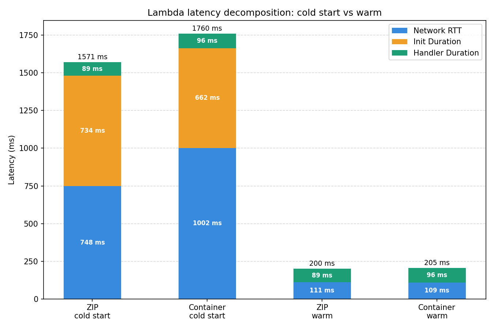
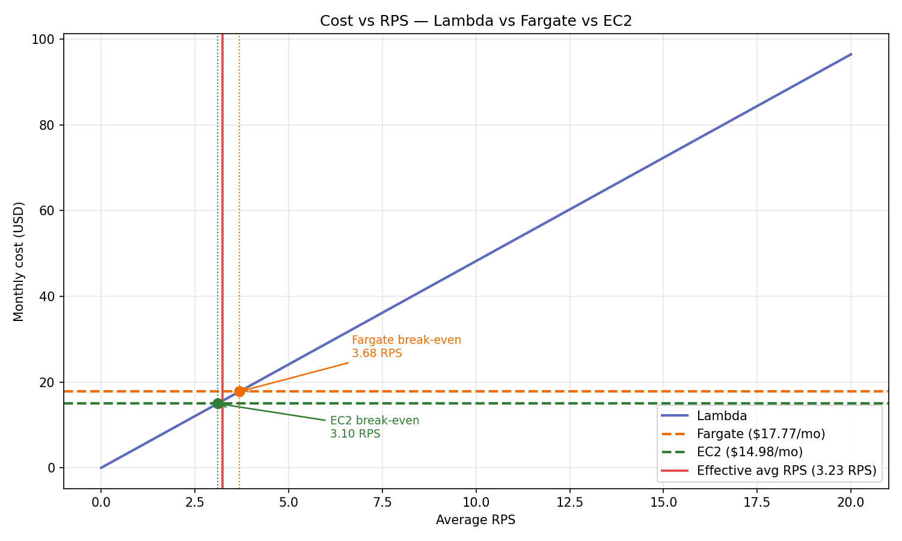

# AWS Cloud Lab Report

## Assignment 1: Deploy All Environments
All four deployment targets produced identical k-NN results for the same query vector, confirming that the search index is consistent across Lambda ZIP, Lambda Container, Fargate, and EC2 environments.
The results are saved in [assignment-1-endpoints.txt](assignment-1-endpoints.txt)
## Assignment 2: Scenario A — Cold Start Characterization
The chart decomposes total latency into Network RTT, Init Duration, and Handler Duration for cold and warm invocations.
### Results

### Analysis
ZIP cold starts are faster than container cold starts (1571 ms vs 1760 ms), mainly because Lambda can unpack a ZIP archive and initialize the runtime much faster than pulling and mounting a container image layer by layer. For warm invocations, both deployments perform nearly identically (~200 ms), confirming that the difference is purely a cold-start initialization cost, not runtime performance.
## Assignment 3: Scenario B — Warm Steady-State Throughput
### Results
| Environment        | Concurrency | p50 (ms) | p95 (ms) | p99 (ms)             | Server avg (ms) |
|--------------------|-------------|----------|----------|----------------------|-----------------|
| Lambda (zip)       | 5           | 200.90   | 221.23   | **468.47 (2.12×)**   | 86.93           |
| Lambda (zip)       | 10          | 196.19   | 217.37   | **457.90 (2.11×)**   | 86.93           |
| Lambda (container) | 5           | 198.54   | 219.68   | **450.43 (2.05×)**   | 78.789          |
| Lambda (container) | 10          | 201.73   | 226.66   | **464.53 (2.05×)**   | 78.789          |
| Fargate            | 10          | 739.50   | 933.80   | 1093.20              | 24.23           |
| Fargate            | 50          | 3703.30  | 3991.50  | 4455.10              | 24.23           |
| EC2                | 10          | 285.20   | 402.10   | **1333.50 (3.32×)**  | 24.576          |
| EC2                | 50          | 787.20   | 1776.60  | 1959.50              | 24.576          |
### Analysis
- Lambda p50 barely changes between c=5 and c=10 because each concurrent request gets its own isolated execution environment — there is no queuing, adding concurrency simply provisions more environments in parallel.

- Fargate/EC2 p50 increases sharply between c=10 and c=50 because both run on a single task/instance with a fixed number of threads — at c=50 incoming requests exceed server capacity and begin queuing. Fargate p50 jumps from 739 ms to 3703 ms (5×), EC2 from 285 ms to 787 ms.

- Client-side p50 is much higher than server-side `query_time_ms` because server-side only measures query execution (~24–87 ms), while client-side additionally includes network RTT, TLS handshake, HTTP overhead, and time spent waiting in Lambda's internal scheduler or load balancer queue.

- p99 > 2× p95 across all Lambda configurations signals tail latency instability caused by occasional scheduler jitter or sporadic cold starts even under warm steady-state conditions.
## Assignment 4: Scenario C — Burst from Zero
### Results
| Environment         | p50 (ms) | p95 (ms) | p99 (ms) | Max (ms) | Cold starts |
|---------------------|----------|----------|----------|----------|-------------|
| Lambda (zip)        | 203.8    | 1513.9   | 1592.3   | 1598.8   | 10          |
| Lambda (container)  | 201.9    | 1245.9   | 1351.0   | 1390.1   | 10          |
| Fargate             | 3647.8   | 4144.1   | 4523.8   | 4911.4   | 0           |
| EC2                 | 809.2    | 978.3    | 1102.0   | 1159.6   | 0           |
### Analysis

* After the 20-minute idle period, all Lambda execution environments were reclaimed by AWS, so the first 10 concurrent requests each triggered a cold start adding 1.2–1.6 s of overhead. Fargate and EC2 run as continuous processes and have no such initialization cost, which is why their tail latencies are driven by application and network factors rather than environment setup.

* The Lambda histogram shows two distinct clusters with no overlap: 189 of 200 requests completed between 175–300 ms, while the remaining 10–11 landed between 1,250–1,600 ms. The cold-start cluster size matches the concurrency cap of 10 exactly — one cold start per newly provisioned execution environment during the burst.

* Lambda does not meet the p99 < 500 ms SLO under burst conditions — both variants recorded p99 values of ~1,351–1,592 ms, around 3× above the threshold. The fix is enabling Provisioned Concurrency to keep environments pre-warmed, or scheduling a warm-up invocation every 5–10 minutes to prevent reclamation during idle periods.

## Assignment 5: Cost at Zero Load
### Results
| Environment | Hourly idle cost | Monthly idle cost |
|-------------|------------------|-------------------|
| Lambda      | $0.00000         | $0.00             | 
| Fargate     | $0.04048         | $13.33            |
| EC2         | $0.02080         | $11.232           | 

### Analysis
Lambda has zero idle cost — it is fully event-driven and only charges per request and execution time. When idle, no requests are sent, so no cost is incurred. \
Fargate and EC2 both incur continuous costs regardless of traffic. Unlike Lambda, these environments keep resources provisioned at all times — the Fargate task container keeps running and the EC2 instance is billed hourly whether or not any requests are being processed.


## Assignment 6: Cost Model, Break-Even, and Recommendation

### 1. Traffic model & assumptions

| Parameter | Value |
|---|---|
| Peak traffic | 100 RPS × 30 min/day |
| Normal traffic | 5 RPS × 5.5 h/day |
| Idle | 18 h/day |
| Requests/month (peak) | 5,400,000 |
| Requests/month (normal) | 2,970,000 |
| Requests/month (total) | 8,370,000 |
| Effective average RPS | 3.23 |
| Lambda memory | 512 MB (0.5 GB) |
| Lambda duration (p50) | 199.3 ms (from Scenario B) |
| Fargate | 0.5 vCPU, 1 GB RAM |
| EC2 | t3.small |

### 2. Monthly cost breakdown

**Lambda**

| Component | Calculation | Cost |
|---|---|---|
| Requests | 8,370,000 × $0.20 / 1M | $1.67 |
| GB-seconds | 8,370,000 × 0.1993s × 0.5 GB × $0.0000166667 | $13.95 |
| **Total** | | **$15.62** |

**Fargate (always-on)**

| Component | Calculation | Cost |
|---|---|---|
| vCPU | 0.5 × $0.04048 × 24 × 30 | $14.57 |
| RAM | 1 GB × $0.004445 × 24 × 30 | $3.20 |
| **Total** | | **$17.77** |

**EC2 (always-on)**

| Component | Calculation | Cost |
|---|---|---|
| t3.small | $0.0208 × 24 × 30 | **$14.98** |

### 3. Break-even RPS — Lambda vs Fargate & EC2

Let R = average RPS sustained 24/7 over 30 days.
```
requests/month       = R × 86,400 × 30 = 2,592,000 × R

cost per request     = $0.20/1M + 0.1993s × 0.5 GB × $0.0000166667
                     = $0.0000002 + $0.00000166
                     = $0.00000187

Lambda cost(R)       = 2,592,000 × R × $0.00000187
                     = $4.84 × R  per month

Break-even vs Fargate:   4.84 × R = 17.77   →   R = 3.67 RPS
Break-even vs EC2:       4.84 × R = 14.98   →   R = 3.10 RPS
```

At the current effective average of 3.23 RPS, Lambda is cheaper than Fargate but already marginally above the EC2 break-even.

### 4. Cost vs. RPS chart



At the effective average RPS of 3.23, Lambda sits just below the Fargate break-even (3.68 RPS) but already above the EC2 break-even (3.10 RPS), making it the cheapest option only marginally and only against Fargate. Any sustained increase in traffic beyond ~3.7 RPS would make always-on infrastructure cheaper than Lambda.

### 5. Recommendation

**Recommended environment: Lambda (zip)**

**Justification**

Under the given traffic model (effective average 3.23 RPS), Lambda (zip) is the cheapest option at $15.62/month, marginally below Fargate ($17.77) and close to EC2 ($14.98). More importantly, it delivers the best steady-state latency — p50 of ~200 ms and p90 of ~217 ms in Scenario B — comfortably within the p99 < 500 ms SLO under normal load. The zip deployment is preferred over the container variant because it has a simpler packaging pipeline and in Scenario B showed comparable warm latencies (p50 196 ms vs 201 ms) with no meaningful difference in throughput.

The one caveat is burst behaviour. In Scenario C, Lambda (zip) recorded a burst p99 of 1,592 ms — more than 3× above the SLO threshold — due to cold starts after the 20-minute idle window. As deployed, it does not meet the SLO under burst. Enabling Provisioned Concurrency for the 10 concurrency slots would eliminate cold starts entirely and bring burst p99 back in line with the warm cluster (~200 ms), at an additional fixed cost of approximately $10–15/month.

**When the recommendation would change**

* If average sustained load exceeds ~3.68 RPS (break-even vs Fargate) or ~3.10 RPS (break-even vs EC2) continuously, always-on infrastructure becomes cheaper. EC2 (t3.small) would be the next choice given its $14.98/month flat cost and stable latency at low concurrency (p50 285 ms at c=10 in Scenario B).
* If the SLO were tightened below ~200 ms p99, none of the tested environments would meet it as deployed.
* If the workload required persistent state, background processing, or longer execution times beyond Lambda's limits, Fargate or EC2 would be the appropriate choice. Fargate showed the worst latency across both scenarios (p50 3,647 ms in Scenario C) and is the most expensive option, making it the least suitable for this specific use case.

**Final recommendation summary**

For the given traffic model (effective average 3.23 RPS) and SLO (p99 < 500 ms), Lambda (zip) is the recommended environment — cheapest at $15.62/month and the only option that meets the SLO under steady-state load (warm p99 ~458 ms). The key condition is enabling Provisioned Concurrency: without it, burst-from-zero pushes p99 to 1,592 ms, more than 3× above the threshold. With 10 pre-warmed environments the cold-start cluster disappears entirely and burst p99 drops back to the warm baseline of ~200 ms.

EC2 (t3.small, $14.98/month) is a viable fallback if Lambda's invocation-based pricing becomes unfavourable — the break-even sits at just 3.10 RPS sustained 24/7, which is close to the current effective average. It delivers stable latency at low concurrency (p50 285 ms at c=10) but degrades noticeably under higher load (p99 1,960 ms at c=50), so it would require auto-scaling to handle burst reliably.

Fargate is not recommended at this traffic level. At $17.77/month it is the most expensive option and simultaneously the worst performer — p99 exceeded 4,500 ms in both Scenario B and Scenario C. It would only become justified if average sustained load exceeded 3.68 RPS continuously, or if the workload required persistent container runtime and orchestration features that Lambda cannot provide.

The recommendation would change in two scenarios: if the SLO were tightened below ~200 ms p99, none of the tested environments would meet it as deployed; and if traffic grew beyond ~3.68 RPS average on a sustained basis, the always-on cost of EC2 would undercut Lambda even with Provisioned Concurrency factored in.